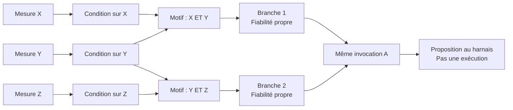

# Activer la mémoire : contrat de propagation

Date : 9 septembre 2026.
Statut : contrat T0 conservé ; T1 implémenté, premier comparateur T2 livré.
Lot T0 : définir la mécanique avant de coder.
Voir le [périmètre réellement livré en T1](ACTIVATION_TOPOLOGIQUE_T1.md) :
propagation sans spikes, fixture manuelle, pas encore d'apprentissage de topologie.
Le [comparateur T2 local aux branches](ACTIVATION_TOPOLOGIQUE_T2.md) ajoute
maintenant le temps et les spikes. Ses [résultats](RESULTATS_TOPOLOGIE_T2.md)
montrent une limite d'arbitrage encore ouverte ; il ne valide pas tout ce contrat.

## 1. Direction et limites de cette étape

> La mémoire est la topologie apprise et ses paramètres révisables.
> La reconnaissance est son activation dans une session.
> La consolidation la modifie à partir d'expériences réellement observées.

La nouvelle voie ne doit pas choisir un régime avant de consulter les branches
qui portent son identifiant. Un régime pourra désigner un motif d'activation
persistant, sans être une condition d'accès obligatoire à la mémoire.

Ce document propose les règles de propagation et d'arbitrage du premier lot.
Le lot T1 en vérifie maintenant la partie combinatoire et le raccordement au
harnais. Les règles temporelles et d'apprentissage restent des propositions
à implémenter et à évaluer dans les lots suivants.

Le nom de travail est `topology-activation`, pas une nouvelle version npm.
Les contrôleurs V1/V2/V3, le continu et les deux resets à spikes restent des
témoins identifiés. Aucun résultat n'est écrasé, aucun défaut n'est changé.
Les résultats du reset modulé ne prouvent pas cette nouvelle architecture.

## 2. Une mémoire, une activation, un flux de contrôle

| Objet | Ce qu'il porte | Propriétaire |
| --- | --- | --- |
| Graphe de flux | Observation, activation, arbitrage, repli, garde, action et évaluation. | Définition construite par l'hôte avec Core. |
| Mémoire | Conditions, motifs, relations vers les invocations, fiabilité et provenance. | Révisions durables et plastiques, partageables en lecture. |
| État d'activation | Potentiels, horloges, entrées reçues et émissions. | États de nœuds dans une session, jamais dans les définitions partagées. |

La représentation mémoire peut utiliser `GraphBuilder`, et sa projection
exécutable `RuntimeGraphBuilder`. Deux objets techniques sont acceptables,
mais une seule source de connaissance : la projection conserve la sémantique
et la provenance des relations mémoire. Elle ne possède pas son propre
classificateur de régimes ou des poids appris indépendamment.

Seules les relations explicitement exécutables transmettent le signal.
Les liens du journal et de provenance ne deviennent pas automatiquement
des connexions neuronales. La mise en page de l'éditeur ne joue aucun rôle.

## 3. La topologie à exécuter

Exemple illustratif, pas sample intégré à la bibliothèque :

La condition Y est partagée, les deux branches restent distinctes.
Leur activation commune ne justifie pas de fusionner leurs fiabilités.

### Cardinalités

- Conditions et motifs peuvent être liés plusieurs à plusieurs.
- Un motif peut soutenir plusieurs branches. Une branche peut combiner plusieurs
  motifs, par une relation ET ou OU explicite.
- Une branche est une relation conditionnelle vers une invocation exacte.
  Plusieurs branches peuvent proposer cette invocation avec des fiabilités
  différentes.
- Une invocation inclut l'action, la capacité et ses paramètres. Deux paramètres
  différents ne deviennent pas la même proposition parce que l'action a le même nom.
- Les expériences peuvent justifier plusieurs éléments de structure. Cela
  n'autorise pas à récompenser toutes les branches actives avec un même résultat.
- Le nombre de nœuds exécutables dépend de cette topologie, pas du nombre de
  régimes : la règle V3 « trois nœuds par régime » ne s'applique plus.

Un graphe manuel valide uniquement la propagation. Il faut un lot distinct
pour démontrer que ses conditions et ses connexions se construisent depuis
les expériences, sans étiquettes de scénario.

## 4. Contrat d'entrée : des observations, pas une réponse

Un cycle reçoit une observation publique, datée et immuable, et un objectif.
L'encodeur traduit les données disponibles ; il ne choisit ni régime ni action.

| Champ logique | Sens |
| --- | --- |
| `observationId` | Identité d'un apport extérieur, indépendante des chemins parcourus. |
| `decisionId` | Identité du cycle de décision. |
| `observedAt`, `availableAt` | Temps physique de mesure et temps de disponibilité, unités explicites. |
| `contextKey`, `intention` | Frontière de compétence et objectif, pas étiquette de régime. |
| `schemaVersion`, `memoryRevision` | Versions utilisées pendant le cycle. |
| `features` | Valeurs, références de sources et états présent, manquant ou invalide. |

L'adaptateur métier déclare les sources, unités et droits. La bibliothèque
ne contient pas de capteur « température usine » ou de commande Counter.
Le premier encodeur d'essai peut être numérique sans prétendre couvrir tous
les types d'observations.

Le numéro de scénario, la graine, une panne cachée ou le résultat futur ne
sont jamais des entrées. Les observations après action servent à apprendre,
pas à justifier rétrospectivement la décision.

Une livraison répétée du même apport ne crée aucune nouvelle évidence.
Une répétition incohérente est rejetée. Plusieurs données simultanées ne
multiplient pas la durée observée. Le contexte et l'objectif restent des
frontières explicites dans le premier lot ; retirer le régime ne démontre
pas un transfert entre objectifs.

## 5. Contrat des messages de propagation

Chaque message conserve :

- L'observation, la décision, les versions de mémoire et d'encodage.
- Le nœud et la relation émetteurs.
- Les références des sources justificatives et les chemins parcourus.
- Un soutien borné entre 0 et 1, ou un état inconnu.
- Les contradictions bloquantes et le temps de l'observation.

Le soutien signifie « ces données correspondent à cette condition ».
Ce n'est pas une probabilité de réussite de l'action.

La confiance historique, une prédiction du raisonneur, une autorisation ou
un succès futur ne sont pas ajoutés au courant d'entrée. Une branche ne doit
pas se convaincre à partir de sa propre activation.

Une ramification recopie les références, elle ne crée pas d'observations.
À une convergence, dédupliquer par apport extérieur et caractéristique.
Conserver les différents chemins pour expliquer le résultat.
Deux caractéristiques d'une même observation peuvent satisfaire deux conditions,
mais elles ne deviennent pas deux expériences de consolidation.

## 6. Règles locales proposées

### 6.1 Condition

Une condition compare une caractéristique courante à une description locale
mémorisée et produit un soutien, une incompatibilité ou « inconnu ».

Dans les fixtures T1, descriptions et tolérances sont déclarées dans le test.
Dans le lot d'apprentissage, elles devront provenir d'observations conservées
et révisables. Recopier un prototype de régime complet dans chaque branche
ne démontre pas l'apprentissage de conditions partageables.

Une valeur manquante n'est pas un zéro. Une contradiction ne peut pas être
effacée par une simple addition de signaux favorables.

### 6.2 Combinaison

| Relation | Première règle proposée | Effet |
| --- | --- | --- |
| ET, toutes les conditions requises | Minimum des soutiens ; inconnu si une entrée requise manque. | Une condition indispensable faible ou absente n'est pas compensée. |
| OU, alternatives suffisantes | Maximum des soutiens connus ; inconnu si aucun n'est disponible. | Une duplication ne gonfle pas le soutien. |
| Invalidation locale | Une contradiction bloquante ferme la branche concernée pour le cycle. | Un potentiel ancien ne contourne pas le constat actuel. |

ET ou OU est une propriété explicite de la relation, pas une conséquence
de l'ordre d'arrivée. Ces règles sont un point de départ mesurable, pas
l'algorithme final de toute reconnaissance.

Le premier lot utilise un graphe exécutable sans cycle. Les relations
historiques peuvent être cycliques sans devenir exécutables. Une récurrence
future nécessitera son propre contrat temporel et ses budgets.

### 6.3 Temps, seuil et émission

Le soutien est traité par une dynamique locale distincte de sa signification.
Les mécanismes LIF du Core seront réutilisés avec les surcharges nécessaires.
Aucun nouveau dispatcher `runStage` ne porte cette logique.

Contraintes du lot temporel :

1. Un apport n'est intégré qu'une fois par nœud et cadre d'observation.
2. Le temps physique écoulé, pas le nombre de sauts ou de copies, détermine
   fuite et intégration.
3. Les potentiels persistent entre cycles d'une même session.
4. Une information inconnue requise ou une contradiction actuelle bloque
   l'émission positive concernée. Le traitement du résidu est déclaré
   explicitement par variante, pas modifié silencieusement.
5. Une émission et son reset ne modifient aucune statistique de réussite.
6. Le résidu seul ne justifie pas une proposition sans soutien actuel.
7. Seuil, fuite et reset sont versionnés et remplaçables. Leur cohérence
   pendant un cycle ne les rend pas définitifs pour la vie du produit.

Un spike est une émission au cours de ce passage, pas une expérience ou
une relance du harnais. Les sauts internes n'avancent pas artificiellement
l'horloge du monde.

Le premier essai à spikes ne reconduit pas implicitement la validité de
trois secondes du détecteur de régime V3 : chaque proposition doit être
soutenue par le cycle courant. La persistance du potentiel et la validité
d'une commande sont distinctes.

Il peut donc rester des cycles sans proposition entre des spikes. Le passage
à une topologie activable ne résout pas automatiquement ce coût.
Une lecture continue du même graphe sera le témoin qui isole l'effet du seuil.
Les constantes de ce lot seront déclarées avant ses mesures, sans réglage
opportuniste sur les cas réservés.

### 6.4 Un passage borné, pas une recherche jusqu'au succès

Chaque nœud traite au plus une fois le cadre courant après résolution de ses
prédécesseurs. Il rassemble ses entrées avant de combiner.

Le silence doit être distingué d'un calcul encore en cours. Les informations
techniques « terminé sans émission » et « entrée manquante » ne sont pas
des spikes positifs, mais leur coût de traitement est compté.

Le passage se clôt avec toutes les propositions disponibles, ou avec un motif
d'absence. L'arbitrage n'est pas déclenché prématurément au premier spike.

Budget dépassé, annulation ou révision incompatible invalident le résultat
partiel. Il n'existe pas de relance cachée jusqu'à obtenir une branche.

## 7. Arbitrage : plusieurs activations, au plus une action

Une proposition terminale comprend une invocation exacte, les branches qui la
soutiennent, leur soutien courant, leur fiabilité et les références de preuve.
Elle n'est jamais un reçu d'autorisation.

Procédure initiale proposée :

1. Collecter toutes les propositions du passage terminé, y compris celles
   de branches qui ne sont pas encore fiables.
2. Regrouper les invocations exactement identiques. Conserver les provenances,
   mais prendre le maximum du soutien, pas leur somme, pour ce premier lot.
3. Vérifier un niveau de soutien suffisant et une séparation suffisante entre
   invocations concurrentes, avec les paramètres déclarés de l'expérience.
4. Si des invocations restent indécidables, utiliser le raisonneur autorisé
   ou une sortie d'abstention prévue par l'hôte. L'ordre des identifiants
   ne justifie pas de choisir une action.
5. Si une invocation se distingue, vérifier qu'une branche suffisamment
   soutenue pour cette invocation possède aussi une fiabilité de rejeu admissible.
6. Vérifier disponibilité des capacités, garde-fous et reçu unique avant
   toute exécution.

Une branche nouvelle fortement soutenue mais encore peu fiable ne doit pas
être remplacée automatiquement par une branche mature moins applicable.
Ce cas demande un repli, pas une confusion entre reconnaissance et réussite.

Deux branches peuvent justifier la même invocation sans que l'on sache encore
laquelle décrit le fonctionnement. Exécuter cette invocation ne constitue
pas une autorisation de récompenser les deux branches.

Un cycle garde au plus une invocation exécutée. Un refus ne provoque pas une
autre tentative masquée. Diagnostic actif et plans multi-actions restent
des étapes différentes.

## 8. Feedback, attribution et plasticité

La propagation est en lecture seule sur la révision mémoire du cycle.
L'apprentissage intervient après exécution autorisée et observation des effets.

Le journal relie observation, proposition, provenance d'activation, invocation
exécutée, observations après action et évaluation. Un cas non attribuable
reste enregistré comme tel, sans résultat ou attribution inventés.

La branche sélectionnée est une hypothèse avant action, pas une vérité.
Les invariants sont :

- Ne pas pénaliser toutes les branches actives ou toutes celles partageant
  une action lorsqu'une situation change.
- Diminuer la fiabilité sur un échec réellement attribuable, même après
  une longue série de succès.
- Consolider une nouveauté à partir d'observations cohérentes et de leur durée,
  pas créer une branche permanente pour chaque contradiction.
- Mémoriser aussi un effet durable défavorable.
- Ne jamais compter une activation comme une réussite ou une nouvelle expérience.
- Corriger une attribution avec historique et retrait de son ancienne contribution.
- Ne pas transférer automatiquement une fiabilité vers un autre objectif.

L'attribution aux fragments d'une topologie partagée reste à implémenter.
Le contrat conservateur initial retient au plus une attribution de compétence
par expérience, ou aucune si l'effet ne départage pas les branches.
Il ne prétend pas résoudre déjà le crédit causal plusieurs à plusieurs.

Le lot d'apprentissage construira des chemins conditions -> motifs -> invocations
depuis le journal. Les règles de création, partage, séparation et révision
seront examinées avant implémentation. Un graphe manuel ou importé valide
l'exécution de mémoire, pas sa construction autonome.

## 9. Raccordement : conserver l'état dans la bonne session

Point vérifié : le runtime actuel crée et ferme une `HarnessSession` à chaque
`step`. Elle ne peut donc pas conserver seule les potentiels d'une histoire.

Le raccordement proposé utilise :

- Une session d'activation Core, possédée par la session d'interaction de l'hôte
  et conservée entre cycles.
- Les `INodeState` pour les potentiels, horloges, caches, compteurs temporels,
  entrées en attente et identités d'émission.
- La `HarnessSession` du cycle pour les paquets et l'autorité d'exécution.
- Un nœud spécialisé qui lance l'activation et un arbitrage spécialisé ;
  les gardes et capacités restent les composants existants.

Deux sessions partageant la même mémoire ne partagent pas leurs potentiels.
La clôture d'un cycle efface ses paquets, pas les potentiels.
Un reset explicite de session d'activation efface les potentiels, pas le journal.

La révision mémoire utilisée est immuable pendant le cycle. Pour le premier lot,
changer topologie ou paramètres de reconnaissance invalide l'état temporaire
de la portée concernée au prochain cycle, avec trace et compteur.
Une modification du journal ou de la fiabilité seule ne doit pas provoquer
ce reset structurel. Le coût de ces invalidations reste visible dans les mesures.

Une reprise de session doit vérifier identités, topologie et encodage.
Un import des potentiels peut être hors du premier lot ; restaurer
silencieusement un état incompatible est interdit.

### Réutilisation et adaptations

| Élément actuel | Traitement prévu |
| --- | --- |
| Builders, `RuntimeNode`, LIF et `Session` du Core | Structure, surcharges et exécution réelle. |
| Journal, statistiques plastiques et provenance | Acquis conservés, attribution aux branches adaptée explicitement. |
| `ExecutionAuthority`, garde et reçu unique | Conservés, aucun spike ne les contourne. |
| `AdaptiveCueObserver` et `TemporalCueObserver` | Témoins V3, pas moteur caché de la nouvelle voie. |
| Lookup conditionné par `modeId` | Ne peut pas filtrer obligatoirement la nouvelle reconnaissance. |
| `ConfidenceGateNode` actuel | Son choix du premier candidat éligible n'implémente pas ce contrat ; prévoir une surcharge d'arbitrage explicite. |
| `HarnessNode` | Conservé pour le flux ; son enveloppe à une entrée consommée ne suffit pas aux convergences ET/OU. |
| Node Editor | Inspection des relations et activations, pas autorité d'apprentissage. |

Les modes historiques peuvent rester dans la provenance. Les renommer en
motifs ne suffit pas, et ils ne sont pas fournis comme réponse de reconnaissance.

Aucune dépendance commerciale ni nouveau framework neuronal n'est nécessaire
pour le premier lot. Samples et règles métier restent hors bibliothèque.

## 10. Exigences de test et motifs d'invalidation

Ce tableau reste le contrat cible. Le [bilan T1](ACTIVATION_TOPOLOGIQUE_T1.md#vérifications-et-limites)
distingue les vérifications implémentées des exigences temporelles et
d'apprentissage encore ouvertes. Il ne faut pas lire ce tableau comme une
validation complète.

| ID | Épreuve | Résultat exigé |
| --- | --- | --- |
| TOP-01 | Couper l'unique relation vers une invocation, données inchangées. | La proposition disparaît ; aucun lookup externe ne contourne la coupure. |
| TOP-02 | Ajouter un chemin vers une autre invocation. | Elle devient candidate par ce chemin ; l'arbitrage voit l'ambiguïté éventuelle. |
| TOP-03 | Condition partagée, ramifications et convergence. | Pas de preuve multipliée par duplication, provenance conservée. |
| TOP-04 | Entrée ET manquante, alternative OU disponible, contradiction locale. | Sémantiques distinctes, sans compensation arbitraire. |
| TOP-05 | Branche mature moins applicable qu'une branche nouvelle. | La fiabilité ne masque pas l'incertitude d'applicabilité. |
| TOP-06 | Même invocation par deux chemins, puis paramètres différents. | Regroupement dans le premier cas, concurrence dans le second. |
| TOP-07 | Observation dupliquée et paquet rejoué après fermeture. | Ni double intégration, ni expérience ou exécution supplémentaire. |
| TOP-08 | Deux sessions sur les mêmes définitions. | États indépendants, définitions inchangées. |
| TOP-09 | Cycles successifs, puis reset explicite. | Potentiels conservés entre cycles ; reset isolé du journal. |
| TOP-10 | Retours A-B-A, longue réussite puis échecs attribuables. | Rappel sans pénaliser une autre branche ; confiance toujours révisable. |
| TOP-11 | Retirer les étiquettes de régime et interdire les appels aux observateurs V3. | La nouvelle voie fonctionne sans classification préalable. |
| TOP-12 | Permuter nœuds, livraisons et coordonnées d'éditeur. | Propositions et décision invariantes après clôture. |
| TOP-13 | Temps irrégulier, arrêt de mesures, soutien courant absent. | Aucun spike autonome exploitable ; délais liés au temps physique. |
| TOP-14 | Révision concurrente et ancien paquet. | Aucun mélange de versions ni réemploi d'autorisation. |
| TOP-15 | Forte activation vers une capacité interdite ou indisponible. | Aucune exécution ni bypass des gardes. |
| TOP-16 | Cycle exécutable, budget dépassé, traitement non terminé. | Rejet ou terminaison explicite, pas de recherche non bornée. |
| TOP-17 | Mémoire vide, apprentissage sur effets observables, puis retour connu. | Chemins construits depuis le journal, pas injectés par le scénario. |
| TOP-18 | Histoires accessibles identiques, effets différents. | Incertitudes et erreurs visibles, aucune prétention à deviner l'inobservable. |

TOP-01 est central : si modifier la topologie pertinente ne change pas les
possibilités d'activation, nous n'avons pas réalisé cette architecture.

## 11. Mesures et comparaison

Conserver les métriques produit : production, qualité, attente, énergie,
violations, récupération et fiabilité du rejeu.

Séparer les compteurs suivants :

| Compteur | Sens |
| --- | --- |
| Observations uniques | Apports publics, pas copies internes. |
| Cycles de décision | Appels du harnais, pas sauts de propagation. |
| Nœuds exécutés et relations livrées | Travail effectif, y compris traitement sans spike et contrôle de clôture. |
| Spikes positifs | Émissions ayant franchi leur condition de propagation. |
| Propositions et invocations distinctes | Branches puis commandes candidates avant arbitrage. |
| Appels au raisonneur | Recours au fournisseur, pas nombre de cycles. |
| Invocations exécutées | Actions effectivement exécutées sous autorisation. |
| Expériences enregistrées et attribuables | Feedback réel et part dont l'attribution est établie. |
| Mémoire et révisions | Nœuds, relations, états de session, taille, reconstructions et resets. |

Un graphe silencieux peut coûter cher si tous ses nœuds sont évalués.
Mesurer temps total et quantiles, encodage, propagation, arbitrage et apprentissage.
Moins de spikes ne constitue pas une mesure CPU.

Les frontières d'épisode et resets sont déclarés, jamais choisis après une erreur.
La session est continue dans un épisode.

Les comparaisons utilisent les mêmes entrées publiques, actions, gardes,
raisonneur et budgets lorsqu'ils sont comparables. Les anciens contrôleurs et
rapports sont conservés. Le raisonneur déterministe du banc n'est pas un gain
de coût LLM déjà démontré.

Réserver aussi des combinaisons de conditions, perturbations simultanées et
autres domaines. Des graines nouvelles seules ne prouvent pas la généralisation.

## 12. Lots proposés

| Lot | Livraison | Limite de la conclusion |
| --- | --- | --- |
| T0, cette étape | Contrat, cardinalités, invariants et tests d'invalidation. | Aucun moteur nouveau livré. |
| T1 | Mémoire-fixture réellement exécutée dans Core, ET/OU, session et arbitrage. | Ni topologie apprise seule, ni intérêt démontré des spikes. |
| T2 | Même topologie avec temps, lecture continue et spikes ; reset nul puis modulé isolés. | Aucun gain produit ou généralisation présumé. |
| T3 | Création et révision de chemins depuis les expériences, attribution conservatrice. | Import V3 et graphe manuel ne suffisent pas. |
| T4 | Adaptateur du banc, comparaison appariée, puis conditions réservées et autre système. | Le corpus fixe seul ne suffit pas à promouvoir la variante. |

Les fixtures, lois numériques et paramètres de T1/T2 seront publiés avant
leurs mesures. T3 nécessite une revue explicite de l'algorithme de construction
des conditions, de partage/scission et d'attribution, pas un service opaque.

Aucune interface ne doit présenter la nouvelle voie comme « mémoire activée »
sans traces de nœuds réellement exécutés et reliés aux relations mémoire.
Les anciennes démonstrations restent identifiées comme V3.

## 13. Repères vérifiés

- [Session de décision](../packages/harness/src/session.ts) et
  [cycle du runtime](../packages/harness/src/runtime.ts).
- [Nœuds du flux](../packages/harness/src/nodes.ts) et
  [autorité d'exécution](../packages/harness/src/authorization.ts).
- [Mémoire conditionnelle](../packages/harness/src/contextual-policy.ts),
  [relations apprises](../packages/harness/src/policy-graph.ts) et
  [plasticité](../packages/harness/src/plasticity.ts).
- [Détecteur V3](../packages/harness/src/temporal-cue-observer.ts) et
  [réseau temporel](../packages/harness/src/temporal-evidence.ts).
- [Résultats du reset modulé](V3_RESET_MODULE.md).
- [Trajectoire](TRAJECTOIRE_V1_V2_V3.md) et
  [généralisation](GENERALISATION_ET_BANCS.md).
